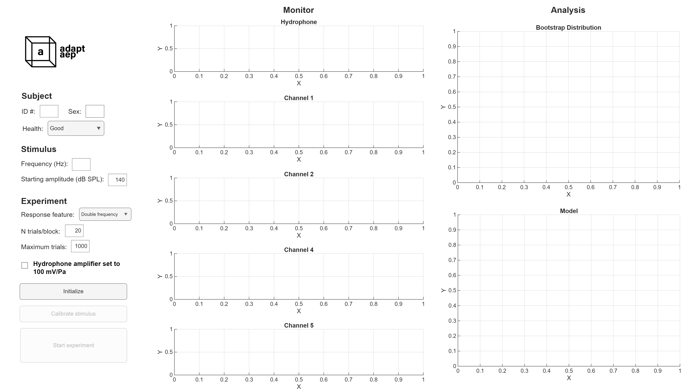

# adapt_aep

Auditory evoked potential (AEP) acquisition software tool with online response detection.

## Key Features
1. Simultaneous presentation of sound stimuli and measurement of electrode signals
2. Live detection of auditory responses
3. Adaptive control of the number of stimulus trials



### Stimuli
The user can select the stimulus frequency (Hz) in the experiment GUI
Stimuli are windowed tone bursts with cosine off and onramps. Stimulus features related to signal and ramp duration can be adjusted in `setup_info.m`

### Electrode
This software is designed for measuremnt of far-field potentials via sub-dermal electrodes. Measurement from surface electrodes is also possible.

### Experiment flow
1. Stimuli will be presented in blocks (The user will indicate the number of trials per block via the GUI)
2. After each block has been measured, the program will perform signal preprocessing and analysis to determine if there is an auditory response present
3. Based on the results from this analysis, the user can decide whether to continue testing at this current stimulus frequency and amplitude, to test the stimulus at a different amplitude, or conclude testing at the current frequency.

## Installation

```bash
# Clone the repository
git clone https://github.com/aoih-uw/adapt_aep.git
cd adapt_aep
```

## Quick Start
1. Edit `setup_info.m` with the experiment parameters specific to your experiment.
2. Run adapt_aep_app.mlapp to launch the experiment GUI 

## Requirements
This software tool currently runs on MATLAB. A complete python version may be developed in the future!

## License

This project is licensed under the MIT License - see the LICENSE file for details.

## Authors

- Aoi Hunsaker - [@aoih-uw](https://github.com/aoih-uw)

## Contact

- Project Link: [https://github.com/aoih-uw/adapt_aep](https://github.com/aoih-uw/adapt_aep)
- Issues: [https://github.com/aoih-uw/adapt_aep/issues](https://github.com/aoih-uw/adapt_aep/issues)

## Status

Project status: In development
