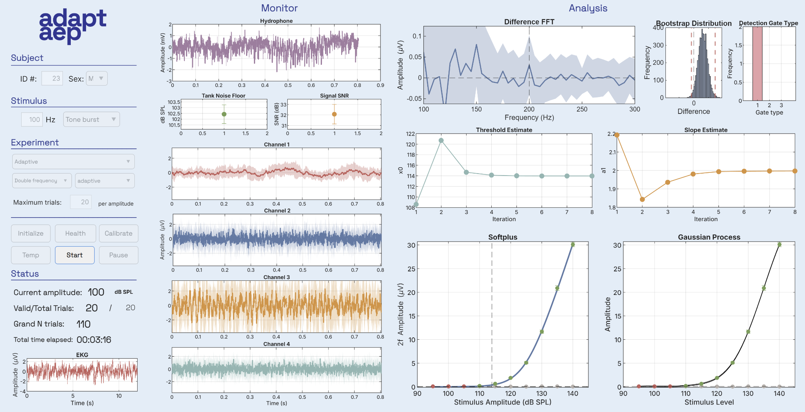

<div align="center">


# adapt_aep

**Auditory evoked potential (AEP) acquisition with online response detection.**

Present sound stimuli and record electrode signals simultaneously, detect
auditory responses online, and let the software adapt how many trials to run.


</div>

---

## Highlights

- **Simultaneous play + record** — stimuli and electrode measurement on the same clock.
- **Live response detection** — FFT and bootstrap tests run between blocks.
- **Adaptive trial counts** — stop collecting as soon as a response is confirmed.
- **Four test modes available** — `Adaptive`, `Static trial count`, `Timed`, and `Mixed stimuli`.

<div align="center">



*The app: subject/stimulus/experiment controls (left), live signal monitor (center), online analysis (right).*

</div>

## How it works

Everything runs from `adapt_aep.mlapp`. **Initialize** builds the experiment
state and hardware; **Start** enters the acquisition loop, which repeats
present → preprocess → analyze → decide until a response is found or a limit
is reached.

## Repository layout

```
src/matlab/
├── adapt_aep.mlapp        # main GUI + orchestrator
├── setup/                 # ex struct, hardware, stimulus template
├── main_loop/             # run_single · run_mixed · present/measure
├── preprocess/            # artefact rejection · filtering
├── analyze/               # separate_subtract_bootstrap · model_response
├── save/                  # raw + session data and figures
├── plot/                  # live monitor & model plots
├── utilities/             # FFT, bootstrap, DAC, EKG helpers
├── calibration/           # stimulus calibration app
└── posthoc/               # offline re-analysis scripts
tests/matlab/              # unit tests with playrec/data mocks
data/aep/                  # per-subject results & figures
```

## Getting started

```bash
git clone https://github.com/aoih-uw/adapt_aep.git
cd adapt_aep
```

1. Edit `src/matlab/setup/setup_info.m` with your experiment parameters.
2. Open `src/matlab/adapt_aep.mlapp` in MATLAB and run it.
3. **Initialize** → optionally **Calibrate stimulus** → **Start experiment**.

**Requirements** — MATLAB with the DSP System, Signal Processing, Audio,
Statistics and Machine Learning, and Curve Fitting toolboxes. Response
detection depends on [`playrec`](http://www.playrec.co.uk/) for synchronized
audio I/O. A Python port may follow.

## License

MIT — see [LICENSE](LICENSE).

## Authors & contact

Aoi Hunsaker — [@aoih-uw](https://github.com/aoih-uw)

Project: <https://github.com/aoih-uw/adapt_aep> ·
Issues: <https://github.com/aoih-uw/adapt_aep/issues>
