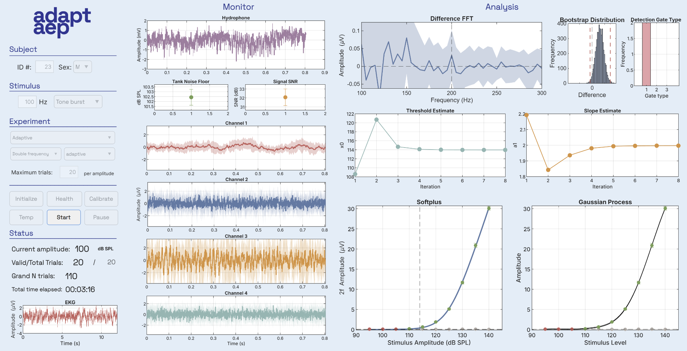

<div align="center">


**Auditory evoked potential (AEP) and particle-acceleration acquisition for underwater hearing studies.**
Present tone bursts, record electrode, hydrophone and accelerometer signals on the same clock, and monitor responses live.


</div>

## Contents
- [🎯 Highlights](#-highlights)
- [🧪 Test modes](#-test-modes)
- [🧠 How it works](#-how-it-works)
- [🔌 Channels & data](#-channels--data)
- [📁 Repository layout](#-repository-layout)
- [🚀 Getting started](#-getting-started)
- [📄 License](#-license)
- [✉️ Authors & contact](#-authors--contact)

---

## 🎯 Highlights
- **Simultaneous play + record:** stimulus output and all inputs share one clock (RME Fireface UCX via `playrec`).
- **Live monitoring:** per-block hydrophone level, tank noise floor, stimulus SNR, sensor traces and a live FFT around the 2f response.
- **Artefact rejection:** clipping and median/MAD-based rejection on electrode (µV) data, with balanced stimulus polarities.
- **Accelerometer mode:** records X/Y/Z particle acceleration alongside one electrode channel, and reports dB re 1 µm/s² with a 3D hodogram.
- **Stimulus calibration:** a hydrophone-based correction factor for each frequency, applied before every experiment.

<div align="center">


*The app: subject/stimulus/experiment controls (left), live signal monitor (center), live FFT and progress plots (right).*

</div>

---

## 🧪 Test modes

| Mode | Description | Accelerometer |
|---|---|---|
| **Timed** | One frequency at 140 dB SPL for a set duration (minutes). Shows live FFT and 2f response tracking. | ❌ |
| **Mixed freqs** | Randomized schedule of frequency × amplitude blocks (default 55/100/410 Hz) until each combination reaches its trial target. Shows a live completion heatmap with 2f traces. | ✅ |

The **test tag** (`test`, `benzo`, `mixed_freqs`, `accelerometer`) is saved in the file name. Choosing `accelerometer` switches the hardware channel map (see below), skips the EKG health check, and is only allowed in Mixed freqs mode.

---

## 🧠 How it works
Everything runs from `adapt_aep.mlapp`:

1. **Initialize** builds the `ex` structure (`setup_info`, `setup_stimulus_info`), sets up the DAC and measures system latency.
2. **Health** (electrode mode only) records and displays the EKG.
3. **Calibrate** runs the calibration app and stores a correction factor for each frequency.
4. **Start** enters the acquisition loop:
   - **Timed** (`run_single`): present block → monitor → save every 20 blocks until time is up.
   - **Mixed** (`run_mixed` → `run_batch`): present block → reject artefacts → re-present until enough clean trials → update progress → save every `N_trials_per_file` trials.

The EKG is re-checked every 15 minutes in electrode mode.

---

## 🔌 Channels & data

| | Electrode mode | Accelerometer mode |
|---|---|---|
| DAC inputs 3–8 | Hydrophone, Loopback, Ch1–Ch4 | Hydrophone, Loopback, X, Y, Z, Ch1 |
| Electrodes | Forebrain, Subcranial, Subcutaneous, EKG | Subcranial |
| Analysis channel | Subcranial | Subcranial |

Raw data for each block (`ex.raw`) is stored as `trials × samples × channels`:
- `electrodes_microV`: electrode data in µV, after bio-amp gain correction
- `accelerometer_mV`: accelerometer data in mV, ordered X, Y, Z (accelerometer mode only)
- `hydrophone_mV`, `loopback`

Files are saved as `.mat` (v7.3) under `data/aep/<subject>/`. Each file contains `info`, `counter`, `block_level_info`, `raw_signals` and `health`.

> **Note:** files recorded before 10/8/2026 use `info.channels` / `info.recording`. Newer files use `info.electrodes` / `info.DAC`. `posthoc_sort_data` reads both.

---

## 📁 Repository layout
```
src/matlab/
├── adapt_aep.mlapp        # main GUI + orchestrator
├── setup/                 # ex struct, experiment parameters (setup_info), DAC + latency
├── main_loop/             # run_single · run_mixed · present/measure · health checks
├── preprocess/            # artefact rejection + polarity balancing
├── plot/                  # live FFT, sensor traces, mixed-progress heatmap, accelerometer hodogram
├── save/                  # raw data saving
├── calibration/           # stimulus calibration app
├── utilities/             # FFT, playrec wrapper, EKG, unit conversions, helpers
├── posthoc/               # offline sorting, summary stats and figures
├── sound_effects/ fonts/  # GUI assets
src/python/                # placeholder for a future Python port (empty)
tests/matlab/              # unit tests (out of date, see Status)
data/aep/                  # per-subject results (git-ignored)
```

---

## 🚀 Getting started
```bash
git clone https://github.com/aoih-uw/adapt_aep.git
cd adapt_aep
```
1. Edit `src/matlab/setup/setup_info.m` with your experiment, hardware and mixed-schedule parameters.
2. Open `src/matlab/adapt_aep.mlapp` in MATLAB and run it.
3. Fill in the subject, test mode, test tag and trial mode.
4. **Initialize** → **Health** (electrode mode) → **Calibrate** → **Start**.

**Requirements:**
- Windows, with an RME Fireface UCX (ASIO) and [`playrec`](http://www.playrec.co.uk/) (`utilities/playrec.mexw64` is included)
- MATLAB with:
  - [ ] Signal Processing Toolbox (`designfilt`, `findpeaks`, `decimate`, `filtfilt`)
  - [ ] Statistics and Machine Learning Toolbox (`prctile`)
  - [ ] Optimization Toolbox (`lsqcurvefit`, posthoc model fitting only)

### Status
- Timed mode supports electrode recordings only.
- `tests/matlab/` still targets the old `ex.info` field names and removed functions, so it does not currently run.

---

## 📄 License
MIT. See [LICENSE](LICENSE).

---

## ✉️ Authors & contact

<div align="center">


Aoi Hunsaker · [@aoih-uw](https://github.com/aoih-uw)

Project: <https://github.com/aoih-uw/adapt_aep> · Issues: <https://github.com/aoih-uw/adapt_aep/issues>

</div>